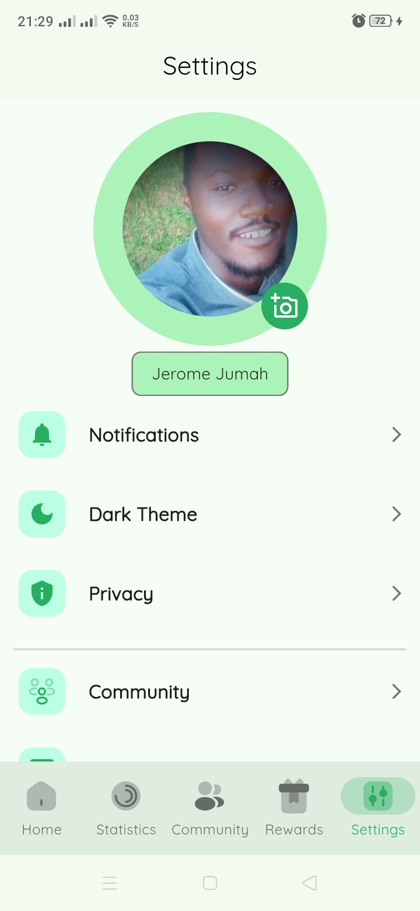

# CarbonZero

The CarbonZero app aims to address this problem by providing users with a platform to
track their carbon emissions and take action to reduce them. The app will offer a range of
features. including carbon tracking, and sustainable lifestyle tips. community challenges, and
more. By using the app, users will be able to make more informed decisions about their
daily activities and make a positive impact on the environment

## Problem Statement

Carbon Emissions from various human activities are contributing to global warming and
climate change, leading to severe environmental and socio-economic consequences. To mitigate the effects Of Climate Change and prevent further damage to the
environment. It is crucial to reduce carbon emissions on an individual and community level.
However. many people are not aware of their carbon footprint or the actions they can take to reduce their impact on the environment.

## Key Features

1. **Carbon Tracking**: Users can track their carbon emissions from various activities such as transportation, energy consumption, and food consumption.
2. **Sustainable Lifestyle Tips**: The app will provide users with tips on how to live a more sustainable lifestyle, such as reducing energy consumption, recycling, and eating less meat.
3. **Community Challenges**: Users can participate in community challenges to reduce carbon emissions and earn rewards.

## Design Inspiration

I was going through twitter and cam along a beautiful design by a designer named [Ayo](https://x.com/theay_o?t=dxzjbpj_bMy188D3_0Jquw&s=08) and I was inspired to create this app. I have attached the design below.
[Design Inspiration](https://www.figma.com/file/kN8GWRfSo40TcEls4bI0EY/CarbonZero?type=design&t=ZWEF6WdvALWxMJpG-6)!
[Behance link](https://www.behance.net/gallery/165836409/CarbonZero-%28-Case-Study-%29)

## App screen shots

<table>
  <tr>
    <td></td>
    <td></td>
    <td></td>
    <td></td>
  </tr>
  <tr>
    <td></td>
    <td></td>
     <td></td>
       <td></td>
  </tr>
    <tr>
    <td></td>
    <td></td>
     <td></td>
    <td></td>
  </tr>
   <tr>
    <td></td>
    <td></td>
     <td></td>
    <td></td>
  </tr>
</table>

## Open to Collaboration

I am open to collaboration. If you have any ideas or suggestions, feel free to open an issue or submit a pull request

## Try It Out

- (Play store link coming soon)
- [Become an internal tester](https://appdistribution.firebase.google.com/testerapps/1:581400212875:android:a68d8eeea6323ec5a7ab8e/releases/6l3s3l6k8inpg?utm_source=firebase-console)

## Tech Stack

This project uses the following technologies:

- Flutter (Android only 🙃 for now)
- Firebase

## Support

If you encounter any problems or have any questions, please open an issue.

## Getting Started

To get started with this project:

1. Clone the repository
2. Ensure you have flutter already installed
3. Set up 2 firebase for your project one for dev and prod (projects should be blaze plan)
4. configure firebase using the `flutterfire cli`
5. Run `flutter pub get`
6. Run `flutter run --flavor dev` to run the app in dev mode
7. Run `flutter run --flavor prod` to run the app in prod mode

## **Warning**

- The app heavily relies on cloud functions and currently the code is not open source. If you want to use the app in production, you can reach out to me and I will help you set it up.
- The core logic of the app that does the carbon tracking is not open source. If you want to use the app in production, you can reach out to me and I will help you set it up.

